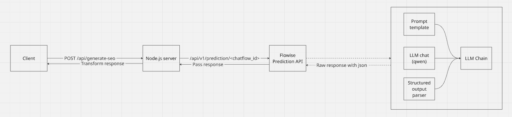

# SEO Segments Generator

The application for generating SEO segments from the product name, category and keywords.




## Prerequisites

We mention our setup under which it should work 100%. If you have alternative setup, it most probably works as well but keeping the information here for alignment.

- Node.js v24.6.0 (nvm 0.40.3)
- Docker version 29.3.0
- Docker Compose version v5.1.1
- jq (jq-1.7)

## How to install

1. Run containerized flowise and ollama services by typing `docker compose up`
2. Create API token from the `http://localhost:3010` admin dashboard (create chatflow permission needed).
3. From inside the `flowise` folder run next command to re-create the chatflow configuration. For authentication use the bearer api token from step 2:
```curl
curl -X POST 'http://localhost:3010/api/v1/chatflows/' \
  -H 'Content-Type: application/json' \
  -H 'Authorization: Bearer <token>' \
  -d @chatflow.json
```
3. Confirm that the chatflow has appeared in admin dashboard
4. Setup local LLM model:
    1. Run `docker ps` and copy the `ollama`'s container ID
    2. Run `docker exec -it <container_id> ollama pull qwen2:1.5b`. That should install the model locally so that it can be used in flowise integration.
5. From inside the chatflow take the chatflow ID (usually available in integration section) and paste in `seo-generator/.env` file (it needs to be created on your own). `CHATFLOW_ID=<your_chatflow_id>`
    1. Other configuration variables can be taken from `.env.example` and kept as is.
6. Run `npm install` from inside `seo-generator`. It should setup the Node.js server
7. Run `npm run start` to spin up the server
8. Make request for the server (using curl or any other HTTP client):
```curl
curl -X POST 'http://localhost:3000/api/generate-seo' \
  -H 'Content-Type: application/json' \
  -d '{"productName":"HydroFlask Stainless Steel Water Bottle","productCategory":"Outdoor & Hydration","keywords":["insulated water bottle","vacuum flask 32oz","double wall stainless steel","bpa free water bottle","hydro flask for hiking","leak proof bottle","cold water 24 hours","wide mouth flask","eco friendly reusable bottle","best insulated water bottle"]}' \
  | jq .
```

## What is present

- Working flow
- Re-tries (3 times) using custom logic in flowise service
- API time-out handling (only for server), status code 408
- Handling empty response from Flowise (we optimistically return empty response fields)
- Handling unexpected error by raising internal server error with status code 500

## What can be improved

- **Streaming was not implemented due to some constraints**: flowise can not stream if structured output parser is used. Meanwhile streaming already buffered data does not make sense. (point for discussion)
- Re-try mechanism should be implemented in more shareable manner
- Validation of configuration variables should be done during bootstrap
- Containerizing Node.js server to simplify application start-up
- Using ollama specific version (not latest)
- Add more tests (time-out, seo service)
- Following REST standard for API endpoints
- Rate limiting
- Handling edge-cases (probably some of the handling is missing)
- Try other models to get better performance